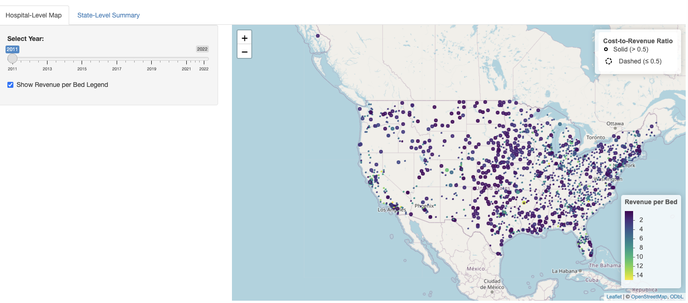
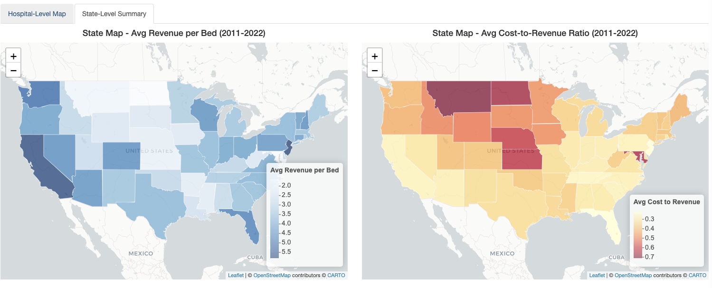
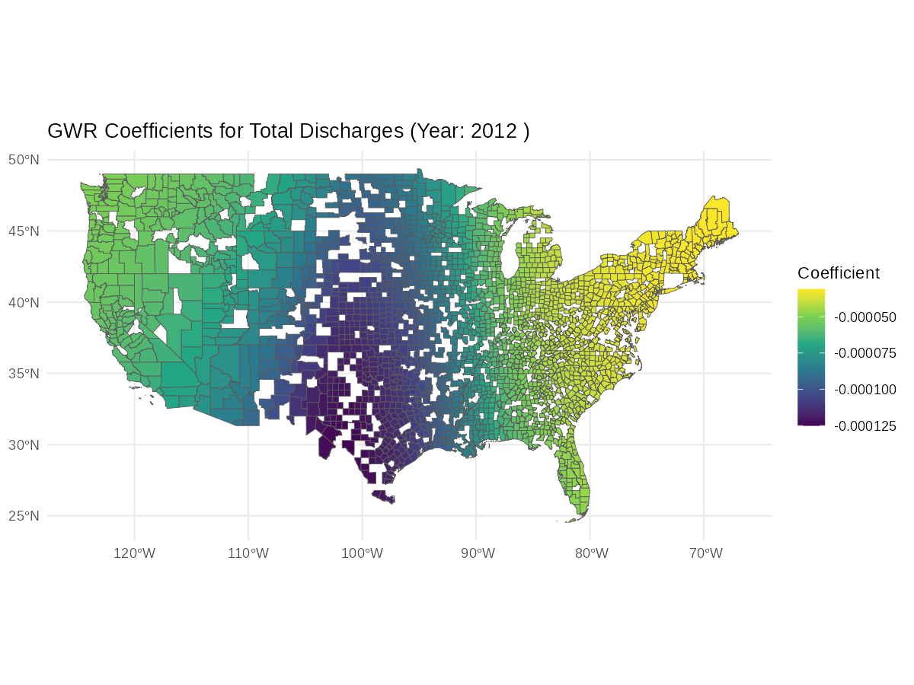
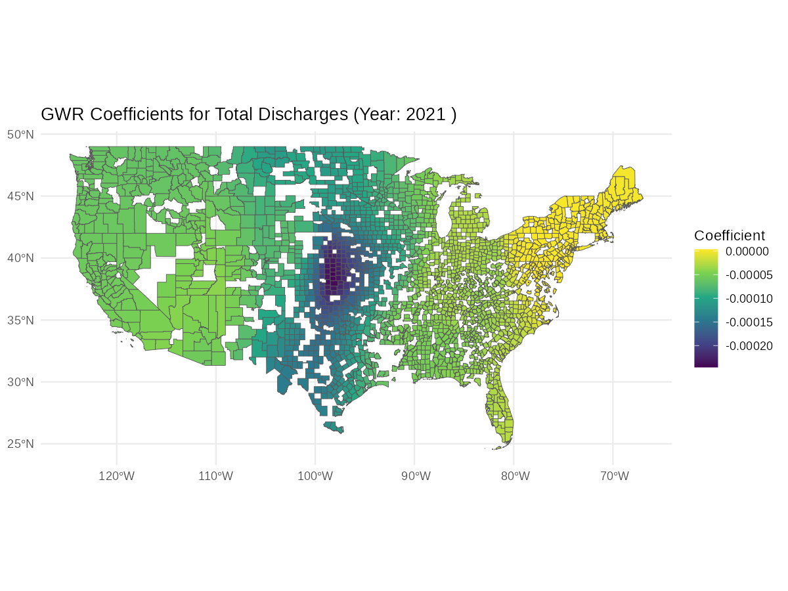
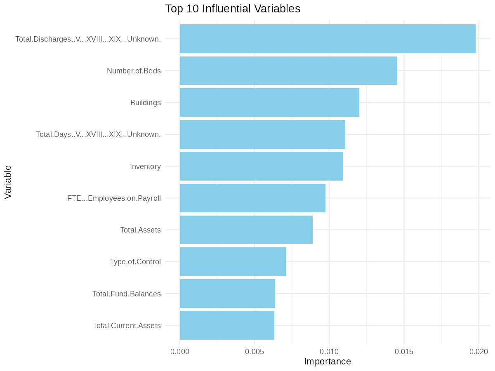

# BIOSTAT 625 Project: Cost Analysis and Forecasting for Hospital Financial Performance

## Overview

This project analyzes and forecasts hospital financial performance using the CMS Hospital Provider Cost Report dataset. By integrating advanced statistical models, machine learning techniques, and interactive visualization tools via R Shiny, this project aims to provide actionable insights into hospital operating efficiency and revenue generation. The analysis spans from 2011 to 2022, focusing on critical metrics such as the **Cost-to-Revenue Ratio** and **Revenue per Bed**.

## Key Features

1. **Data Cleaning and Preparation**

2. **Interactive R Shiny Application**
   - **Tab 1:** Dot Distribution Map for hospital-level financial metrics.
   - **Tab 2:** State-level aggregation of metrics with temporal trends.
   - Temporal slider and interactive pop-ups for enhanced usability.

3. **Statistical and Machine Learning Analysis**
   - Run Geographically Weighted Regression with multiprocessing to find out the spatial heterogeneity across the dependent variables
   - Run Machine Learning with multiprocessing to fit the best model to predict the dependent variable

---

## Contributors

- **Charlotte Xu**: R Shiny and statistical summary.
- **Ruiyang Dong**: Introduction and co-lead on data cleaning.
- **Xuyuan Zhang**: Co-lead on data cleaning, lead on linear models and spatial analysis.
- **Zihan Wang**: Machine learning implementation and analysis.

---

## Code Structure:

**Codes are listed in the sources directory**:

- [data_cleaning.R](https://github.com/sergiozxy/BIOSTAT625-Project/blob/main/sources/data_cleaning.R) is the starting code to clean and form a clean result
- [linear_model.R](https://github.com/sergiozxy/BIOSTAT625-Project/blob/main/sources/linear_model.R) can then be used based on the cleaned dataset to carry out easy OLS, FE regression model
- [summary_statistics.R](https://github.com/sergiozxy/BIOSTAT625-Project/blob/main/sources/linear_model.R) and [plot_distribution.R](https://github.com/sergiozxy/BIOSTAT625-Project/blob/main/sources/plot_distribution.R) can be used to check the statistical distribution of the results.
- [spatial_analysis.R](https://github.com/sergiozxy/BIOSTAT625-Project/blob/main/sources/linear_model.R) is the code to carry out county level and state level geographically weighted regression model and it can be used to generate the result. You need to have a multicore computer (at least 4) to be able to run the code.
- [machine_learning.R](https://github.com/sergiozxy/BIOSTAT625-Project/blob/main/sources/machine_learning.R) is the code to carry out the machine learning code, and it uses 5-fold cross validation to verify the result and it uses multiprocess techniques, and you also need to have a multicore computer (at least 4) to be able to run the code.

## Detailed Reports

Detailed Reports can be seen at [final_report](https://github.com/sergiozxy/BIOSTAT625-Project/blob/main/final_report/final_report.pdf)

## R Shiny Walkthrough




### Deployed Version
The R Shiny application is deployed at [https://xxchar.shinyapps.io/hospital-financial-analysis-ui/](https://xxchar.shinyapps.io/hospital-financial-analysis-ui/).

### Run Locally
To run the application locally, follow these steps:
1. Clone the repository:
   ```bash
   git clone https://github.com/sergiozxy/BIOSTAT625-Project.git
   ```
2. Open HospitalRevenue_map_ui/ui.R and HospitalRevenue_map_ui/server.R to launch the R Shiny application.
3. Run the application to explore hospital financial metrics interactively.


---

## Geographically Weighted Regression Walkthrough




## Machine Learning Walkthough

   
  
